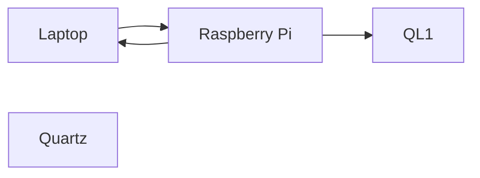
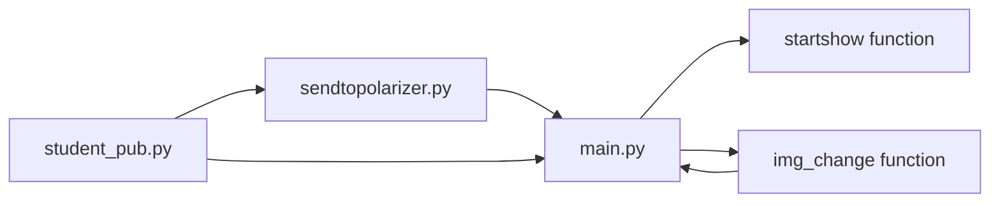

# Pixel Tint 32 x 32 System
This project is an interactive system that teaches us about the physical phenomenon on polarization of lights. Polarisers are controlled by motors to display pixelated images using different angles to create different shades of grey
## Our Feature

# ★Story Telling Show★
Our feature is about a captivating story of a couple's journey together as a pair and taking the viewers with them through their ups and downs during the relationship

<br>

In this generation, many audiences are more drawn to drama and films these days which majority includes romantic genre's. Hence, we want our audiences, teenagers and adults from 13-21 year old to witness our show, and for them to either relate to or just appreciate at the end of it.
<br>

We want to showcase the emotions and feelings of the story through lights and audio, and having the visuals from our very own pixelated images displayed out to the Pixel Tint Panel.
## What our feature consist of:
**Main GUI** 
- Our GUI shows all of the images that will be displayed on the show starting from image 1 to image 16.
- Each image is a button. When button pressed individually **(right frame)**, the image will appear on the blank canvas **(left frame)**, and will send out the image on the polarizer.

*Picture of the Polarizer Panel*
- At the bottom, we have the "Start Show" button which is a command that will automatically send all 16 images in a sequence of 15 seconds delay for each image.

*Screenshot of our GUI*

<br>

## Components
---
| No. | Equipment |
| ----------- | ----------- |
| 1. | Raspberry Pi 4 |
| 2. |  XLR-M to 3.5mm-M stereo |
| 3. |  **Avolites** Lighting Console |
| 4. |  Mixer - **Model: Yamaha QL1**|
| 5. |  Audio Amplifier - **Model: NXAMP4X2MK2**|
| 6. |  Speakers Line Array and Subwoofers|


## Setup
---
## **Hardware Set Up**

<br>

**Audio Setup:**
<br>

1. Connect Raspberry Pi 4 to a power source
2. Using the XLR-M to a 3.5mm-M stereo cable, connect the 3.5mm jack into the Raspberry Pi 4 and the XLR-M to input 1 & 2 of the audio mixer.
3. Using a CAT6 ethernet cable, connect the amplifier to the mixer.
4. Using NL4 cables, connect the speakers and subwoofers to the audio amplifier.


*Picture of Audio Setup*

**Lighting Setup:**
<br>

The lights are being controlled manually in a console. Hence, it is a separate setup on its own.
<br>

1. In S536, the lights are connected and pre-patched in the console
2. For each image of our story, we created either cues or chases. We used lights such as the SL ePAR180,
3. 


## Communication of hardware 



---

## **Software Set Up** ##

<br>

## Communication of devices


# **Installing libraries**

To install the required libraries on our Raspberry Pi 4, we would need to open the terminal.
<br>
<br>
Firstly, update and upgrade your Raspberry Pi 4 using ```sudo apt update``` and ```sudo apt upgrade```.

<br>

### MQTT
To allow the Raspberry Pi 4 to publish a message to the broker pi, we would need to install the following;

<br>

#### MQTT Client <br>
```sudo apt install -y mosquitto-clients```
<br>
#### Install python MQTT script 
``` sudo pip3 install paho-mqtt```


---
## Flow of code ##




