# Pixel Tint 32 x 32 System
This project is an interactive system that teaches us about the physical phenomenon on polarization of lights. Polarisers are controlled by servo motors to display pixelated images by rotating the polarizers to different angles to create different shades of grey.
## Our Feature

# ★Story Telling Show★
Our feature is about a captivating story of a couple's journey together and taking the viewers with them through their ups and downs during the relationship.

<br>

In this generation, many audiences are more drawn to drama and films these days which majority includes romantic genre's. Hence, we want our audiences, teenagers and adults from 13-21 year old to witness our show, and for them to either relate to or just appreciate at the end of it.
<br>

We want to showcase the emotions and feelings of the story through the lights and audio, and having the visuals from our very own pixelated images displayed out to the Pixel Tint Panel.

# Polariser Panel


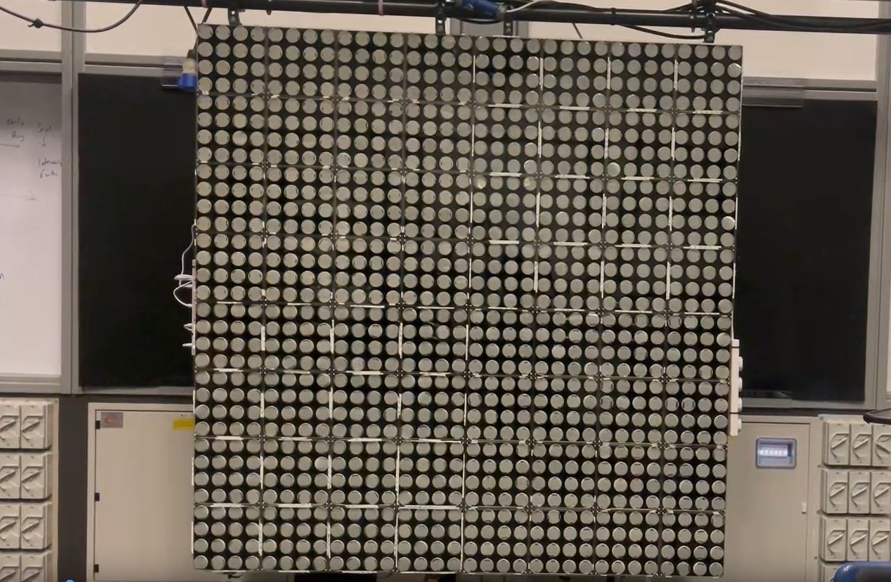<br>
*Picture of the Polarizer Panel*

- This is the polarizer panel which will be used to display our pixelized image.
- Each one of the circles is a polarizing film which is being controlled by a servo motor which receives instructions from the micro-controller.
# Our Features
## What it consists of:
**Main GUI** 
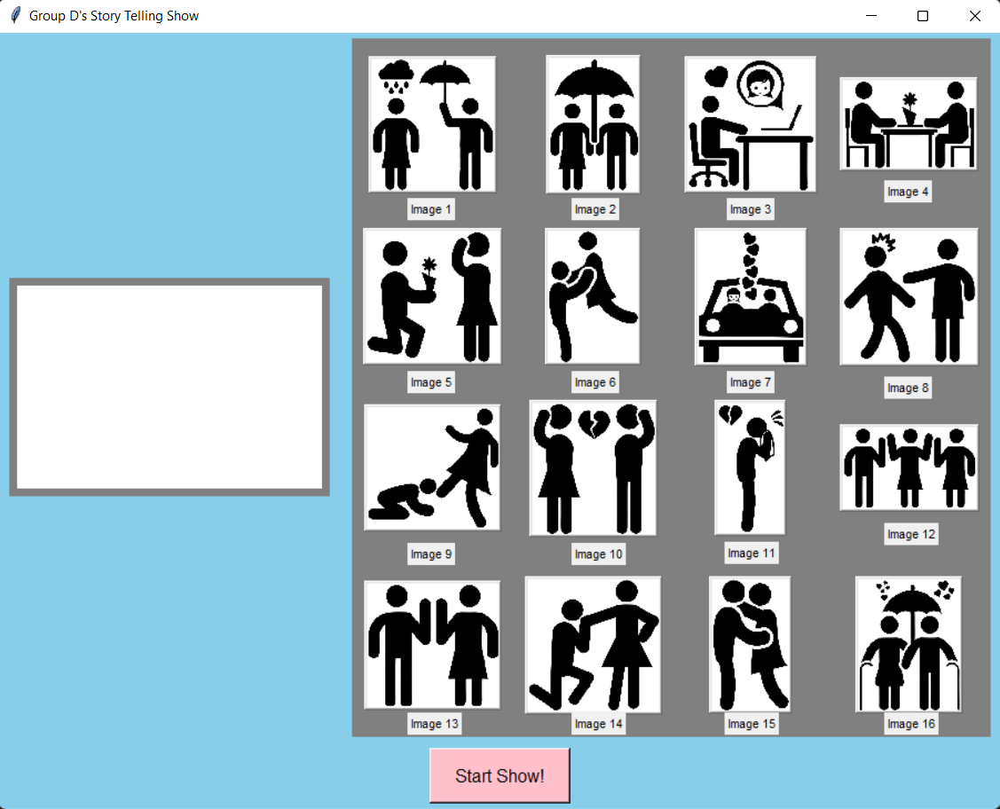<br>
*Screenshot of our GUI*
- Our GUI shows all of the images that will be displayed on the show starting from image 1 to image 16.
- Each image is a **button**. When the button is pressed individually **(right frame)**, the image will appear on the blank canvas **(left frame)**, and it will send out the image onto the polarizer panel.
<br>
*Close up of Image Buttons*
<br>
*Example of Image 2 after being pressed*
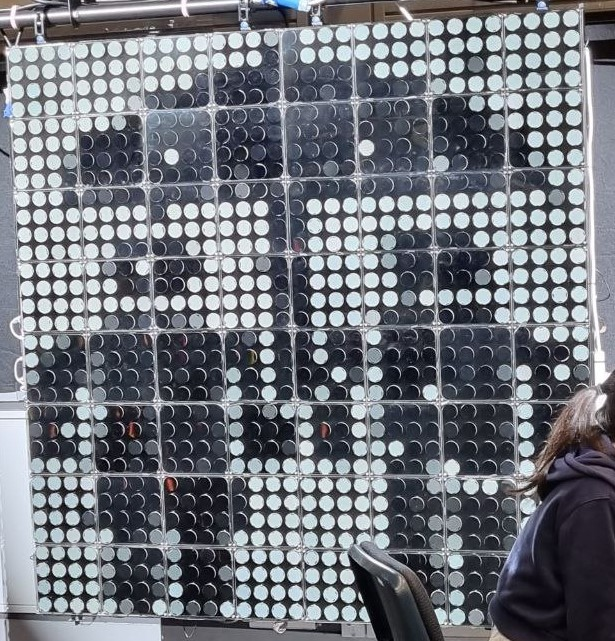<br>
*Image on the Polarizer Panel*


- At the bottom, we have the "Start Show" button which is a command that will automatically send all 16 images in a sequence of 15 seconds delay for each image to the polarizer panel.

<br>
*Screenshot of Start Show Button*
<br>


# **Setup**

### Getting the Raspberry Pi 4 connected

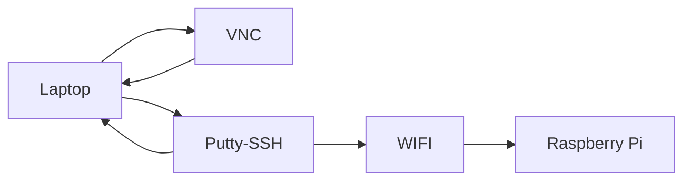

## Getting IP address to connect Raspi
>Open command prompt to find the network's IPv4 Address
```
ipconfig
```

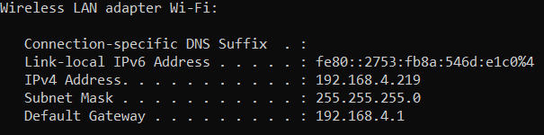<br>
*Screenshot of IPv4 address*


## Advnaced Port Scanner
>Based on the IPv4 address found, scan the network for your pi's IPv4 address
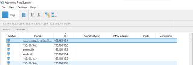<br>
*Port scan of the network*

## Initial Boot of the Raspberry Pi 4
---
1. **Secure Shell (SSH)** into Raspberry Pi using **Putty**
```
Hostname: pi@ip_address
Port: 22
Password: (enter your password here)
```
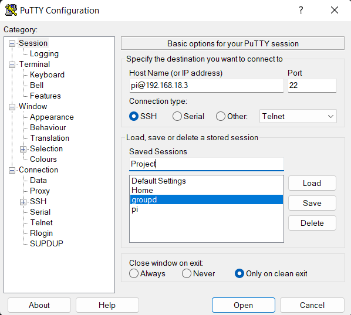<br>
*Screenshot of PuTTY configuration*

>"Save" and then "Load"
2. After logging in, update and upgrade raspberry pi
```
sudo apt update
sudo apt upgrade
```
## Configuring the Pi
---
>Enabling SSH
```
sudo raspi-config
```
Select `Interface Options` <br>
Select `P2 SSH`

>Enabling VNC
```
sudo raspi-config
```
Select `Interface Options`<br>
Select ` P3 VNC`

## VNC Viewer

>VNC is used to access the pi remotely.
<br>
File>New Connection 
<br>
Add your raspberry pi's IPv4 and name

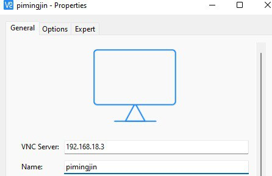

<br>

*VNC Viewer*

<br>
Now after connecting, we have successfully established remote control to the raspberry pi. 


<br>

---
<br>

# **Hardware Set Up**


### **Components**

| No. | Equipment |
| ----------- | ----------- |
| 1. |  Laptop |
| 2. |  Raspbery Pi 4 **OS: Raspbian Buster Full**|
| 3. |  **Avolite Quartz** Titan Lighting Console |
| 4. |  Mixer - **Model: Yamaha QL1**|
| 5. |  Audio Amplifier - **Model: NXAMP4X2MK2**|
| 6. |  Speakers Line Array and Subwoofers **Model: P620 & L18**|

<br>

**Audio Setup:**
<br>

1. Connect Raspberry Pi 4 to a power source.
2. Using the XLR-M to a 3.5mm-M stereo cable, connect the 3.5mm jack into the Raspberry Pi 4 and the XLR-M to input 1 & 2 of the audio mixer.
3. Using a CAT6 ethernet cable, connect the amplifier to the mixer.
4. Using NL4 cables, connect the speakers and subwoofers to the audio amplifier.

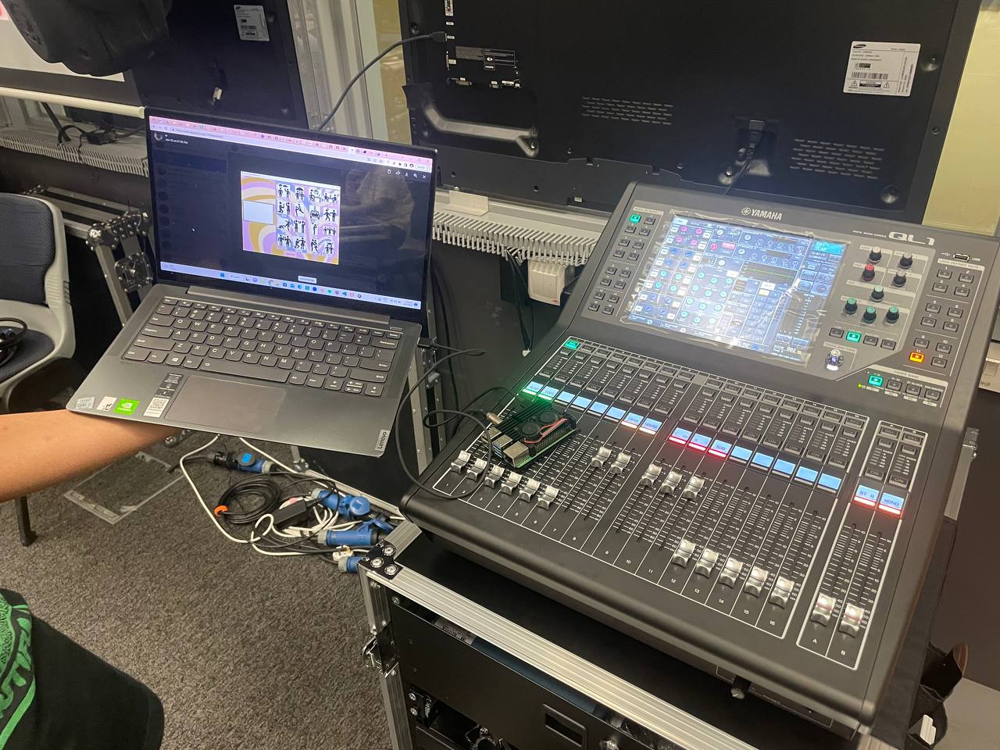<br>
*Picture of Audio Setup*
<br>

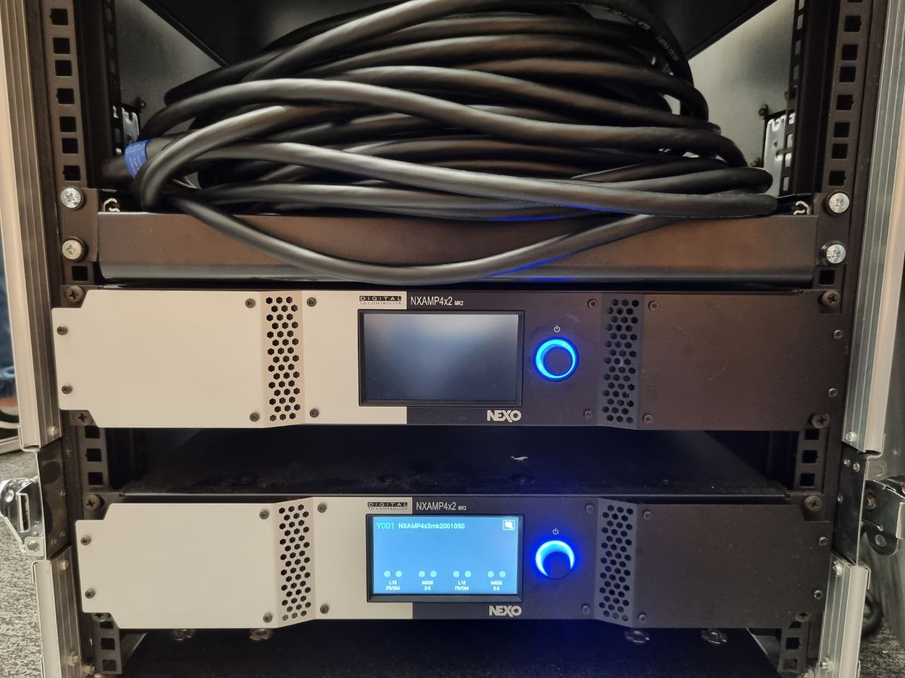<br>
*Picture of the Amplifier*

---
To create our show background track, we installed the software **Audacity**
<br>

<br>
*Screenshot of all our wav files commpiled into timelines*
<br>
- The first track is our voice story narrator where we used a text to speech feature from an online website called **NaturalReaders**
- The second track and third track consists of the Background Music instrumentals throughout the duration
- The third timeline compiles all of our sound effects<br>
<br>
**We got our BGM and Sound Effects from the website freesound.org*

We compiled the above tracks all into one **wav** file.

**Lighting Setup:**
<br>

The lights are being controlled manually in a console. Hence, it is a separate setup on its own.
<br>

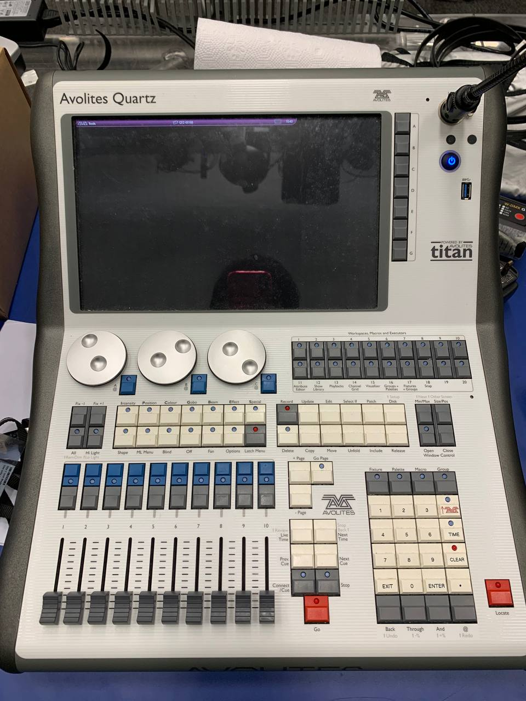<br>
*Picture of console we used*

1. In S536, the lights are connected and pre-patched in the console
2. For each image of our story, we created either cues or chases, with the use of gobos, colours and fixtures. Lights such as the SL ePAR180, MiniPnl-Fx, Mistral-TC and MagicalFX were utilised.

.jpg)<br>
*Page one of our Cuelists and Chase*

.jpg)<br>
*Page two of our Cuelists and Chase*
<br>

3. After creating our cues and chases, we made a record using the **Timeline** feature in the console. It allows us to record our cues and chase in one go.


## **Communication of Hardware** 
The graph below shows the way our devices are communicating with each other. We have our laptop used for VNC for our Raspberry Pi 4 to take control of the GUI. The Raspberry Pi sends audio out using the 3.5mm audio jack to our audio mixer which sends the signal out to our speakers. We then have a lighting console which is manually operated.

Note that the lighting console is standalone for now.
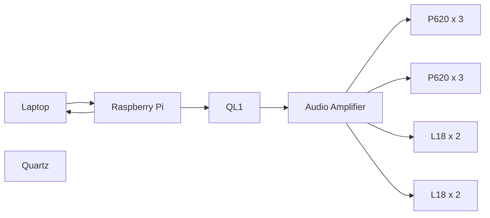
*Graph showing the communication between devices*

<br>

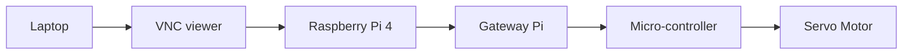
*Graph showing the communication to the polarizing panel*

---
<br>


# **Installing libraries**

To install the required libraries on our Raspberry Pi 4, we would need to open the terminal.

Certain libraries that we need like *tkinter*, *time*, and *threading* are already preinstalled in Raspberry Pi and there is no need to install them.

<br>

### Updating and upgrading your Pi
---

Firstly, update and upgrade your Raspberry Pi 4 using ```sudo apt update``` and ```sudo apt upgrade```.

<br>

### **MQTT**
---
To allow the Raspberry Pi 4 to publish a message to the broker pi, we would need to install the following;


#### Installing the MQTT client
```sudo apt install -y mosquitto-clients```
<br>
#### Install python MQTT script 
``` sudo pip3 install paho-mqtt```

### **Pillow**
---
To allow our Raspberry Pi to do basic image processing, we would need to install the PIL (pillow) library. To install the library,
<br>
```pip install pillow``` or ```python3 -m pip install pillow```

### **Pydub**
---
Installing the pydub library allows us to play, merge and edit our .wav audio files. To install the library,
<br>

```pip install pydub```

---

After installing the relevant modules, open Raspberry Pi terminal and clone the repository inside.
<br>

```git clone https://github.com/weijiehiew/EGL314.git```

<br>


---
## Flow of code ##


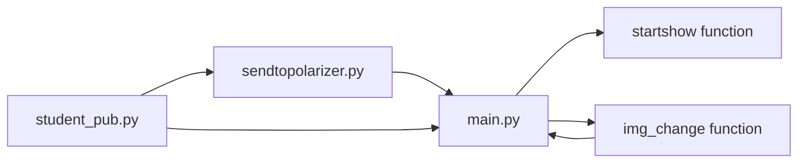
<br>

# Running the GUI

To run the GUI from the terminal,

```python3 /home/pi/EGL314/main.py```


