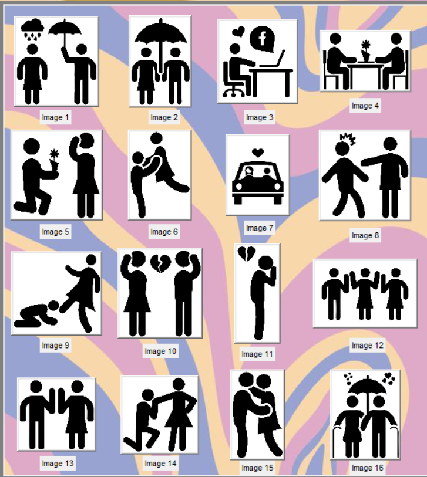
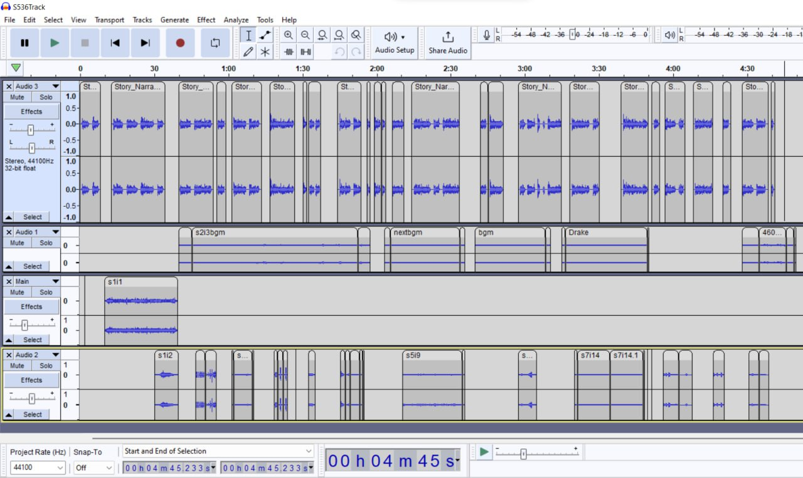

# Pixel Tint 32 x 32 System
This project is an interactive system that teaches us about the physical phenomenon on polarization of lights. A panel made up of 1024 circular polarisers, which are controlled by servo motors. It displays out pixelated images by rotating the polarizers to different angles to create different shades of grey.

# ★Story Telling Show★
Our feature is about a captivating story of a couple's journey together and taking the viewers with them through their ups and downs during the relationship.

<br>

From our conducted research, we have realised that in this generation many audiences are more commonly drawn to drama and films these days. An example would be the popular K-Drama Series Business Proposal or the Western Series Never Have I Ever. Majority of which includes romantic genre's. Our show consists just that with a hint of comedy to entice our audiences. Therefore, we are aiming for teenagers and adults ranging from 13-21 year old to witness our show, or anyone in general. So that they could have something to relate to or just appreciate the artwork.
<br>

We want to showcase the emotions and feelings of the story through the lights and audio, and having the visuals from our very own pixelated images displayed out to the Pixel Tint Panel.

<br>

---

# Polariser Panel


<br>
*Picture of the Polarizer Panel*

- This is the polarizer panel which will be used to display our pixelized images.
- Each one of the disc is a polarizing film which is being controlled by a servo motors which receive instructions from the micro-controllers.
- In front of each panel will be another piece of polarizer film.
- When the discs turn, the different angles of the 2 polarizers will slowly block out lights (0° is white, 90° is black), showing different shades of grey.

---

# Understanding the Pixel Tint System

In this system, we use a publish-subscribe network protoccol called "MQTT".

<br>
This is so that it is possible for us to send different images to display out into the polarising panel

<br>
So in this scenario,

- Our Raspberry Pi(client) would be publishing to a Broker Pi.
- When our Group Pi publishes to the Broker Pi, the Broker Pi will then subscribe to the micro-controllers behind the panels
- We ensured that the Broker Pi is in the same network as our Raspberry Pi(client), as well as the micro-controllers to be able to publish

---

# Our Features
## What it consists of:
**1. Main GUI** 
<br>
*Screenshot of our GUI*
- Our GUI shows all of the images that will be displayed on the show starting from image 1 to image 16.
- Each image is a **button**. When the button is pressed individually **(right frame)**, the image will appear on the blank canvas **(left frame)**, and it will send out the image onto the polarizer panel.

<br>
*Close up of Image Buttons*

<br>
*Example of Image 2 after being pressed*

<br>
*Image on the Polarizer Panel*


- At the bottom, we have the "Start Show" button which is a command that will automatically send all 16 images in a sequence of 15 seconds delay for each image to the polarizer panel.
<br>
*Screenshot of Start Show Button*


<br>
*GIF shows the output values of each images being sent out in a sequence*

<br>

**2. Lighting**
<br>
- The use of colourful lights to enhance the audience experience as well as to create an ambiance


<br>

[Lighting Feature](#lighting-setup)<br>
**See how we setup and prepared out lights*
<br>

**3. Audio**
<br>
- The use of Voice Narration, Background Music and Sound Effects to comprehend the sequence of images being displayed out

<br>

[Lighting Feature](#audio-setup)<br>
**See how we setup and prepared out audio*

<br>

# **System Diagrams**

## **Communication of Hardware** 
The graph below shows the way our devices communicate with each other. We have our laptop used for VNC for the Raspberry Pi 4 to take control of our Graphical User-Interface. The Raspberry Pi sends audio out using the 3.5mm audio jack to our audio mixer which sends the signal out to our speakers. We then have a lighting console which is manually operated.

Note that the lighting console is standalone for now.

*Graph shows the communication between devices*

<br>


*Graph shows the communication to the polarizing panel*

---

<br>

## **Flow of code** 


*Graph shows the flow the python files*

---

# **Components**

| No. | Equipment |
| ----------- | ----------- |
| 1. |  Laptop |
| 2. |  Raspbery Pi 4 **OS: Raspbian Buster Full**|
| 3. |  **Avolite Quartz** Titan Lighting Console |
| 4. |  Mixer - **Model: Yamaha QL1**|
| 5. |  Audio Amplifier - **Model: NXAMP4X2MK2**|
| 6. |  Speakers Line Array and Subwoofers **Model: P620 & L18**|

<br>

# **Setting up Raspberry Pi 4**

## Hardware
- Hardware: Raspberry Pi Model B(4GB) <br>
- Operating System: Raspbian Buster Full


<br>
*Fu YongWei, EGL314 - Lecture 1 Module Introduction*

<br>

## Software
1. VNC Viewer
2. PuTTY
3. Advanced Port Scanner

### Getting the Raspberry Pi 4 connected


## Getting IP address to connect Raspi
>Open command prompt to find the network's IPv4 Address
```
ipconfig
```

<br>
*Screenshot of IPv4 address*


## Advnaced Port Scanner
>Based on the IPv4 address found, scan the network for your pi's IPv4 address
<br>
*Port scan of the network*

## Initial Boot of the Raspberry Pi 4
---
1. **Secure Shell (SSH)** into Raspberry Pi using **Putty**
```
Hostname: pi@ip_address
Port: 22
Password: (enter your password here)
```
<br>
*Screenshot of PuTTY configuration*

>"Save" and then "Load"
2. After logging in, update and upgrade raspberry pi
```
sudo apt update
sudo apt upgrade
```
## Configuring the Pi
---
>Enabling SSH
```
sudo raspi-config
```
Select `Interface Options` <br>
Select `P2 SSH`

>Enabling VNC
```
sudo raspi-config
```
Select `Interface Options`<br>
Select ` P3 VNC`

## VNC Viewer

>VNC is used to access the pi remotely.
<br>
File>New Connection 
<br>
Add your raspberry pi's IPv4 and name


<br>

*VNC Viewer*

<br>
Now after connecting, we have successfully established remote control to the raspberry pi. 


<br>

---
<br>


# **Installing libraries**

To install the required libraries on our Raspberry Pi 4, we would need to open the terminal.

Certain libraries that we need like *tkinter*, *time*, and *threading* are already preinstalled in Raspberry Pi and there is no need to install them.

<br>

### Updating and upgrading your Pi
---

Firstly, update and upgrade your Raspberry Pi 4 using ```sudo apt update``` and ```sudo apt upgrade```.

<br>

### **MQTT**
---
To allow the Raspberry Pi 4 to publish a message to the broker pi, we would need to install the following;


#### Installing the MQTT client
```sudo apt install -y mosquitto-clients```
<br>
#### Install python MQTT script 
``` sudo pip3 install paho-mqtt```

### **Pillow**
---
To allow our Raspberry Pi to do basic image processing, we would need to install the PIL (pillow) library. To install the library,
<br>
```pip install pillow``` or ```python3 -m pip install pillow```

### **Pydub**
---
Installing the pydub library allows us to play, merge and edit our .wav audio files. To install the library,
<br>

```pip install pydub```

---


<br>

# Lights and Audio Preparation
After you have got your Raspberry Pi setup ready, we can start lights and audio creations.

---
## **Lighting Setup:**
### **Hardware**: Avolites Quartz Titan Console
<br>
*Image of console from Google*

<br>
The lights are being controlled manually in a console. Hence, it is a separate setup on its own.
<br>

<br>
*Picture of console*

1. In S536, the lights are connected and pre-patched in the console
2. For each image of our story, we created either cues or chases, with the use of gobos, colours and fixtures. Lights such as the SL ePAR180, MiniPnl-Fx, Mistral-TC and MagicalFX were utilised.

.jpg)<br>
*Page one of our Cuelists and Chase*

.jpg)<br>
*Page two of our Cuelists and Chase*
<br>

3. After creating our cues and chases, we made a live recording using the **Timeline** feature in the console. It allows us to record our cues and chase in one go.

<br>
*Image shows the timeline fader brought up*

<br>
*GIF shows our timeline creation with cues and chase recorded*

<br>

## **Audio Setup:**
### **Hardware:**

1. Yamaha QL1 Digital Mixing Console
<br>
*Image of Mixer from Google*

2. NEXO NXAMP4X2MK2 Audio Amplifier
<br>
*Image of Amplifier from Google*

2. Raspberry Pi 4
3. Laptop (For Power Source)

### **Software:** Audacity (Audio Editor)
<br>
*Image of Software Logo from Google*

<br>

1. Connect Raspberry Pi 4 to a power source.
2. Using the XLR-M to a 3.5mm-M stereo cable, connect the 3.5mm jack into the Raspberry Pi 4 and the XLR-M to input 1 & 2 of the audio mixer.
3. Using a CAT6 ethernet cable, connect the amplifier to the mixer.
4. Using NL4 cables, connect the speakers and subwoofers to the audio amplifier.

<br>
*Picture of Audio Setup*
<br>

<br>
*Picture of the Amplifier*

---
To create our show background track, we installed the software **Audacity**
<br>

<br>
*Screenshot of all our wav files commpiled into timelines*
<br>
- The first track is our voice story narrator where we used a text to speech feature from an online website called **NaturalReaders**
- The second track and third track consists of the Background Music instrumentals throughout the duration
- The third timeline compiles all of our sound effects<br>
<br>

**We got our BGM and Sound Effects from the website freesound.org*

<br>

We compiled the above tracks all into one **wav** file.

# Code Explanation
**Importing of Libraries**
<br>

These are the necessary libraries we used in order to develop our storytelling show
```
from tkinter import *
import time
import sendtopolarizer
from PIL import Image, ImageOps
from student_pub import *
from pydub import AudioSegment
from pydub.playback import play
import threading
```
**16 Images Buttons**
<br>

Creating the 16 push buttons and labelled individually (16 images):
```
image1button = Button(frame2, image=image1, command=lambda m=1:img_change(m))
image1button.grid(row=0, column=0, padx=10, pady=15)
label1 = Label(frame2, text="Image 1",font=("Calibri, 8"))
label1.place(x=50, y=144)

image2button = Button(frame2, image=image2, command=lambda m=2:img_change(m))
image2button.grid(row=0, column=1, padx=10, pady=15)
label2 = Label(frame2, text="Image 2",font=("Calibri, 8"))
label2.place(x=198, y=144)

image3button = Button(frame2, image=image3, command=lambda m=3:img_change(m))
image3button.grid(row=0, column=2, padx=10, pady=15)
label3 = Label(frame2, text="Image 3",font=("Calibri, 8"))
label3.place(x=328, y=144)

image4button = Button(frame2, image=image4, command=lambda m=4:img_change(m))
image4button.grid(row=0, column=3, padx=10, pady=15)
label4 = Label(frame2, text="Image 4",font=("Calibri, 8"))
label4.place(x=472, y=128)

image5button = Button(frame2, image=image5, command=lambda m=5:img_change(m))
image5button.grid(row=1, column=0, padx=10, pady=15)
label5 = Label(frame2, text="Image 5",font=("Calibri, 8"))
label5.place(x=50, y=300)

image6button = Button(frame2, image=image6, command=lambda m=6:img_change(m))
image6button.grid(row=1, column=1, padx=10, pady=15)
label6 = Label(frame2, text="Image 6",font=("Calibri, 8"))
label6.place(x=198, y=300)

image7button = Button(frame2, image=image7, command=lambda m=7:img_change(m))
image7button.grid(row=1, column=2, padx=10, pady=15)
label7 = Label(frame2, text="Image 7",font=("Calibri, 8"))
label7.place(x=328, y=295)

image8button = Button(frame2, image=image8, command=lambda m=8:img_change(m))
image8button.grid(row=1, column=3, padx=10, pady=15)
label8 = Label(frame2, text="Image 8",font=("Calibri, 8"))
label8.place(x=472, y=305)

image9button = Button(frame2, image=image9, command=lambda m=9:img_change(m))
image9button.grid(row=2, column=0, padx=10, pady=15)
label9 = Label(frame2, text="Image 9",font=("Calibri, 8"))
label9.place(x=50, y=455)

image10button = Button(frame2, image=image10, command=lambda m=10:img_change(m))
image10button.grid(row=2, column=1, padx=10, pady=15)
label10 = Label(frame2, text="Image 10",font=("Calibri, 8"))
label10.place(x=190, y=463)

image11button = Button(frame2, image=image11, command=lambda m=11:img_change(m))
image11button.grid(row=2, column=2, padx=10, pady=15)
label11 = Label(frame2, text="Image 11",font=("Calibri, 8"))
label11.place(x=322, y=467)

image12button = Button(frame2, image=image12, command=lambda m=12:img_change(m))
image12button.grid(row=2, column=3, padx=10, pady=15)
label12 = Label(frame2, text="Image 12",font=("Calibri, 8"))
label12.place(x=472, y=455)

image13button = Button(frame2, image=image13, command=lambda m=13:img_change(m))
image13button.grid(row=3, column=0, padx=10, pady=20)
label13 = Label(frame2, text="Image 13",font=("Calibri, 8"))
label13.place(x=50, y=616)

image14button = Button(frame2, image=image14, command=lambda m=14:img_change(m))
image14button.grid(row=3, column=1, padx=10, pady=20)
label14 = Label(frame2, text="Image 14",font=("Calibri, 8"))
label14.place(x=190, y=616)

image15button = Button(frame2, image=image15, command=lambda m=15:img_change(m))
image15button.grid(row=3, column=2, padx=10, pady=20)
label15 = Label(frame2, text="Image 15",font=("Calibri, 8"))
label15.place(x=322, y=622)

image16button = Button(frame2, image=image16, command=lambda m=16:img_change(m))
image16button.grid(row=3, column=3, padx=10, pady=20)
label16 = Label(frame2, text="Image 16",font=("Calibri, 8"))
label16.place(x=472, y=622)
```
To put the respective images on the buttons:
```
#open images
pic1 = PhotoImage(file="Resources/2.png")
pic2 = PhotoImage(file="Resources/3.png")
pic3 = PhotoImage(file="Resources/4.png")
pic4 = PhotoImage(file="Resources/5.png")
pic5 = PhotoImage(file="Resources/6.png")
pic6 = PhotoImage(file="Resources/7.png")
pic7 = PhotoImage(file="Resources/8.png")
pic8 = PhotoImage(file="Resources/10.png")
pic9 = PhotoImage(file="Resources/11.png")
pic10 = PhotoImage(file="Resources/12.png")
pic11 = PhotoImage(file="Resources/13(1).png")
pic12 = PhotoImage(file="Resources/15.png")
pic13 = PhotoImage(file="Resources/16.png")
pic14 = PhotoImage(file="Resources/17.png")
pic15 = PhotoImage(file="Resources/18.png")
pic16 = PhotoImage(file="Resources/19.png")

#resize the images
image1 = pic1.subsample(6, 6)
image2 = pic2.subsample(6, 6)
image3 = pic3.subsample(7, 7)
image4 = pic4.subsample(6, 6)
image5 = pic5.subsample(6, 6)
image6 = pic6.subsample(6, 6)
image7 = pic7.subsample(5, 5)
image8 = pic8.subsample(6, 6)
image9 = pic9.subsample(6, 6)
image10 = pic10.subsample(6, 6)
image11 = pic11.subsample(6, 6)
image12 = pic12.subsample(6, 6)
image13 = pic13.subsample(7, 7)
image14 = pic14.subsample(7, 7)
image15 = pic15.subsample(6, 6)
image16 = pic16.subsample(6, 6)
```
Defined a function for the buttons to be able to send out through the broker:
```
def img_change(m):
    ## open image file
        if m == 1:
                img1 = PhotoImage(file="Resources/2.png")
                label.configure(image=img1)
                label.image = img1
                #print(Image)
                myImage =               Image.open('/home/pi/EGL314/Resources/2.png')
                ## greyscale image file
                greyImage = ImageOps.grayscale(myImage)
                #greyImage.show()

                ## Limiting to 8 shades of greyscale colour
                greyQuantize = greyImage.quantize(8)
                #greyQuantize.show()

                ## resize to 32 x 32 pixels
                smallImage = greyQuantize.resize((32,32), Image.BILINEAR)
                #smallImage.show()

                ## Blow it back up to original photo size (32 x 32 pixels upscale)
                resultImage = smallImage.resize(myImage.size, Image.NEAREST)
                #resultImage.show()

                ## Write Image to save .png file
                ##resultImage.save('cartoon.png')

                # Retrieving pixel value and formating it into list of list
                x = 32; k = 0; outputValue = [0 for i in range(x)]
                for i in range(x):
                  outputValue[i] = [0 for j in range(x)]
                pixValue = list(smallImage.getdata())

                for i in range(x):
                 for j in range(x):
                        outputValue[i][j] = pixValue[k]
                        k = k + 1;

                print(outputValue)
                pubpic(outputValue)
        elif m ==2:
                img1 = PhotoImage(file="Resources/3.png")
                label.configure(image=img1)
                label.image = img1
                #print(Image)
                myImage = Image.open('/home/pi/EGL314/Resources/3.png')
                ## greyscale image file
                greyImage = ImageOps.grayscale(myImage)
                #greyImage.show()

                ## Limiting to 8 shades of greyscale colour
                greyQuantize = greyImage.quantize(8)
                #greyQuantize.show()

                ## resize to 32 x 32 pixels
                smallImage = greyQuantize.resize((32,32), Image.BILINEAR)
                #smallImage.show()

                ## Blow it back up to original photo size (32 x 32 pixels upscale)
                resultImage = smallImage.resize(myImage.size, Image.NEAREST)
                #resultImage.show()

                ## Write Image to save .png file
                ##resultImage.save('cartoon.png')

                # Retrieving pixel value and formating it into list of list
                x = 32; k = 0; outputValue = [0 for i in range(x)]
                for i in range(x):
                  outputValue[i] = [0 for j in range(x)]
                pixValue = list(smallImage.getdata())

                for i in range(x):
                 for j in range(x):
                        outputValue[i][j] = pixValue[k]
                        k = k + 1;

                print(outputValue)
                pubpic(outputValue)
        elif m ==3:
                img1 = PhotoImage(file="Resources/4.png")
                label.configure(image=img1)
                label.image = img1
                #print(Image)
                myImage = Image.open('/home/pi/EGL314/Resources/4.png')
                ## greyscale image file
                greyImage = ImageOps.grayscale(myImage)
                #greyImage.show()

                ## Limiting to 8 shades of greyscale colour
                greyQuantize = greyImage.quantize(8)
                #greyQuantize.show()

                ## resize to 32 x 32 pixels
                smallImage = greyQuantize.resize((32,32), Image.BILINEAR)
                #smallImage.show()

                ## Blow it back up to original photo size (32 x 32 pixels upscale)
                resultImage = smallImage.resize(myImage.size, Image.NEAREST)
                #resultImage.show()

                ## Write Image to save .png file
                ##resultImage.save('cartoon.png')

                # Retrieving pixel value and formating it into list of list
                x = 32; k = 0; outputValue = [0 for i in range(x)]
                for i in range(x):
                  outputValue[i] = [0 for j in range(x)]
                pixValue = list(smallImage.getdata())

                for i in range(x):
                 for j in range(x):
                        outputValue[i][j] = pixValue[k]
                        k = k + 1;

                print(outputValue)
                pubpic(outputValue)
        elif m ==4:
                img1 = PhotoImage(file="Resources/5.png")
                label.configure(image=img1)
                label.image = img1
                #print(Image)
                myImage = Image.open('/home/pi/EGL314/Resources/5.png')
                ## greyscale image file
                greyImage = ImageOps.grayscale(myImage)
                #greyImage.show()

                ## Limiting to 8 shades of greyscale colour
                greyQuantize = greyImage.quantize(8)
                #greyQuantize.show()

                ## resize to 32 x 32 pixels
                smallImage = greyQuantize.resize((32,32), Image.BILINEAR)
                #smallImage.show()

                ## Blow it back up to original photo size (32 x 32 pixels upscale)
                resultImage = smallImage.resize(myImage.size, Image.NEAREST)
                #resultImage.show()

                ## Write Image to save .png file
                ##resultImage.save('cartoon.png')

                # Retrieving pixel value and formating it into list of list
                x = 32; k = 0; outputValue = [0 for i in range(x)]
                for i in range(x):
                  outputValue[i] = [0 for j in range(x)]
                pixValue = list(smallImage.getdata())

                for i in range(x):
                 for j in range(x):
                        outputValue[i][j] = pixValue[k]
                        k = k + 1;

                print(outputValue)
                pubpic(outputValue)
        elif m ==5:
                img1 = PhotoImage(file="Resources/6.png")
                label.configure(image=img1)
                label.image = img1
                #print(Image)
                myImage = Image.open('/home/pi/EGL314/Resources/6.png')
                ## greyscale image file
                greyImage = ImageOps.grayscale(myImage)
                #greyImage.show()

                ## Limiting to 8 shades of greyscale colour
                greyQuantize = greyImage.quantize(8)
                #greyQuantize.show()

                ## resize to 32 x 32 pixels
                smallImage = greyQuantize.resize((32,32), Image.BILINEAR)
                #smallImage.show()

                ## Blow it back up to original photo size (32 x 32 pixels upscale)
                resultImage = smallImage.resize(myImage.size, Image.NEAREST)
                #resultImage.show()

                ## Write Image to save .png file
                ##resultImage.save('cartoon.png')

                # Retrieving pixel value and formating it into list of list
                x = 32; k = 0; outputValue = [0 for i in range(x)]
                for i in range(x):
                  outputValue[i] = [0 for j in range(x)]
                pixValue = list(smallImage.getdata())

                for i in range(x):
                 for j in range(x):
                        outputValue[i][j] = pixValue[k]
                        k = k + 1;

                print(outputValue)
                pubpic(outputValue)
        elif m ==6:
                img1 = PhotoImage(file="Resources/7.png")
                label.configure(image=img1)
                label.image = img1
                #print(Image)
                myImage = Image.open('/home/pi/TeamD/Resources/7.png')
                ## greyscale image file
                greyImage = ImageOps.grayscale(myImage)
                #greyImage.show()

                ## Limiting to 8 shades of greyscale colour
                greyQuantize = greyImage.quantize(8)
                #greyQuantize.show()

                ## resize to 32 x 32 pixels
                smallImage = greyQuantize.resize((32,32), Image.BILINEAR)
                #smallImage.show()

                ## Blow it back up to original photo size (32 x 32 pixels upscale)
                resultImage = smallImage.resize(myImage.size, Image.NEAREST)
                #resultImage.show()

                ## Write Image to save .png file
                ##resultImage.save('cartoon.png')

                # Retrieving pixel value and formating it into list of list
                x = 32; k = 0; outputValue = [0 for i in range(x)]
                for i in range(x):
                  outputValue[i] = [0 for j in range(x)]
                pixValue = list(smallImage.getdata())

                for i in range(x):
                 for j in range(x):
                        outputValue[i][j] = pixValue[k]
                        k = k + 1;

                print(outputValue)
                pubpic(outputValue)
        elif m ==7:
                img1 = PhotoImage(file="Resources/8.png")
                label.configure(image=img1)
                label.image = img1
                #print(Image)
                myImage = Image.open('/home/pi/EGL314/Resources/8.png')
                ## greyscale image file
                greyImage = ImageOps.grayscale(myImage)
                #greyImage.show()

                ## Limiting to 8 shades of greyscale colour
                greyQuantize = greyImage.quantize(8)
                #greyQuantize.show()

                ## resize to 32 x 32 pixels
                smallImage = greyQuantize.resize((32,32), Image.BILINEAR)
                #smallImage.show()

                ## Blow it back up to original photo size (32 x 32 pixels upscale)
                resultImage = smallImage.resize(myImage.size, Image.NEAREST)
                #resultImage.show()

                ## Write Image to save .png file
                ##resultImage.save('cartoon.png')

                # Retrieving pixel value and formating it into list of list
                x = 32; k = 0; outputValue = [0 for i in range(x)]
                for i in range(x):
                  outputValue[i] = [0 for j in range(x)]
                pixValue = list(smallImage.getdata())

                for i in range(x):
                 for j in range(x):
                        outputValue[i][j] = pixValue[k]
                        k = k + 1;

                print(outputValue)
                pubpic(outputValue)
        elif m ==8:
                img1 = PhotoImage(file="Resources/10.png")
                label.configure(image=img1)
                label.image = img1
                #print(Image)
                myImage = Image.open('/home/pi/EGL314/Resources/10.png')
                ## greyscale image file
                greyImage = ImageOps.grayscale(myImage)
                #greyImage.show()

                ## Limiting to 8 shades of greyscale colour
                greyQuantize = greyImage.quantize(8)
                #greyQuantize.show()

                ## resize to 32 x 32 pixels
                smallImage = greyQuantize.resize((32,32), Image.BILINEAR)
                #smallImage.show()

                ## Blow it back up to original photo size (32 x 32 pixels upscale)
                resultImage = smallImage.resize(myImage.size, Image.NEAREST)
                #resultImage.show()

                ## Write Image to save .png file
                ##resultImage.save('cartoon.png')

                # Retrieving pixel value and formating it into list of list
                x = 32; k = 0; outputValue = [0 for i in range(x)]
                for i in range(x):
                  outputValue[i] = [0 for j in range(x)]
                pixValue = list(smallImage.getdata())

                for i in range(x):
                 for j in range(x):
                        outputValue[i][j] = pixValue[k]
                        k = k + 1;

                print(outputValue)
                pubpic(outputValue)
                
        elif m ==9:
                img1 = PhotoImage(file="Resources/11.png")
                label.configure(image=img1)
                label.image = img1
                #print(Image)
                myImage = Image.open('/home/pi/EGL314/Resources/11.png')
                ## greyscale image file
                greyImage = ImageOps.grayscale(myImage)
                #greyImage.show()

                ## Limiting to 8 shades of greyscale colour
                greyQuantize = greyImage.quantize(8)
                #greyQuantize.show()

                ## resize to 32 x 32 pixels
                smallImage = greyQuantize.resize((32,32), Image.BILINEAR)
                #smallImage.show()

                ## Blow it back up to original photo size (32 x 32 pixels upscale)
                resultImage = smallImage.resize(myImage.size, Image.NEAREST)
                #resultImage.show()

                ## Write Image to save .png file
                ##resultImage.save('cartoon.png')

                # Retrieving pixel value and formating it into list of list
                x = 32; k = 0; outputValue = [0 for i in range(x)]
                for i in range(x):
                  outputValue[i] = [0 for j in range(x)]
                pixValue = list(smallImage.getdata())

                for i in range(x):
                 for j in range(x):
                        outputValue[i][j] = pixValue[k]
                        k = k + 1;

                print(outputValue)
                pubpic(outputValue)
        elif m ==10:
                img1 = PhotoImage(file="Resources/12.png")
                label.configure(image=img1)
                label.image = img1
                #print(Image)
                myImage = Image.open('/home/pi/EGL314/Resources/12.png')
                ## greyscale image file
                greyImage = ImageOps.grayscale(myImage)
                #greyImage.show()

                ## Limiting to 8 shades of greyscale colour
                greyQuantize = greyImage.quantize(8)
                #greyQuantize.show()

                ## resize to 32 x 32 pixels
                smallImage = greyQuantize.resize((32,32), Image.BILINEAR)
                #smallImage.show()

                ## Blow it back up to original photo size (32 x 32 pixels upscale)
                resultImage = smallImage.resize(myImage.size, Image.NEAREST)
                #resultImage.show()

                ## Write Image to save .png file
                ##resultImage.save('cartoon.png')

                # Retrieving pixel value and formating it into list of list
                x = 32; k = 0; outputValue = [0 for i in range(x)]
                for i in range(x):
                  outputValue[i] = [0 for j in range(x)]
                pixValue = list(smallImage.getdata())

                for i in range(x):
                 for j in range(x):
                        outputValue[i][j] = pixValue[k]
                        k = k + 1;

                print(outputValue)
                pubpic(outputValue)
        elif m ==11:
                img1 = PhotoImage(file="Resources/13(1).png")
                label.configure(image=img1)
                label.image = img1
                #print(Image)
                myImage = Image.open('/home/pi/EGL314/Resources/13.png')
                ## greyscale image file
                greyImage = ImageOps.grayscale(myImage)
                #greyImage.show()

                ## Limiting to 8 shades of greyscale colour
                greyQuantize = greyImage.quantize(8)
                #greyQuantize.show()

                ## resize to 32 x 32 pixels
                smallImage = greyQuantize.resize((32,32), Image.BILINEAR)
                #smallImage.show()

                ## Blow it back up to original photo size (32 x 32 pixels upscale)
                resultImage = smallImage.resize(myImage.size, Image.NEAREST)
                #resultImage.show()

                ## Write Image to save .png file
                ##resultImage.save('cartoon.png')

                # Retrieving pixel value and formating it into list of list
                x = 32; k = 0; outputValue = [0 for i in range(x)]
                for i in range(x):
                  outputValue[i] = [0 for j in range(x)]
                pixValue = list(smallImage.getdata())

                for i in range(x):
                 for j in range(x):
                        outputValue[i][j] = pixValue[k]
                        k = k + 1;

                print(outputValue)
                pubpic(outputValue)
        elif m ==12:
                img1 = PhotoImage(file="Resources/15.png")
                label.configure(image=img1)
                label.image = img1
                #print(Image)
                myImage = Image.open('/home/pi/EGL314/Resources/15.png')
                ## greyscale image file
                greyImage = ImageOps.grayscale(myImage)
                #greyImage.show()

                ## Limiting to 8 shades of greyscale colour
                greyQuantize = greyImage.quantize(8)
                #greyQuantize.show()

                ## resize to 32 x 32 pixels
                smallImage = greyQuantize.resize((32,32), Image.BILINEAR)
                #smallImage.show()

                ## Blow it back up to original photo size (32 x 32 pixels upscale)
                resultImage = smallImage.resize(myImage.size, Image.NEAREST)
                #resultImage.show()

                ## Write Image to save .png file
                ##resultImage.save('cartoon.png')

                # Retrieving pixel value and formating it into list of list
                x = 32; k = 0; outputValue = [0 for i in range(x)]
                for i in range(x):
                  outputValue[i] = [0 for j in range(x)]
                pixValue = list(smallImage.getdata())

                for i in range(x):
                 for j in range(x):
                        outputValue[i][j] = pixValue[k]
                        k = k + 1;

                print(outputValue)
                pubpic(outputValue)
        elif m ==13:
                img1 = PhotoImage(file="Resources/16.png")
                label.configure(image=img1)
                label.image = img1
                #print(Image)
                myImage = Image.open('/home/pi/EGL314/Resources/16.png')
                ## greyscale image file
                greyImage = ImageOps.grayscale(myImage)
                #greyImage.show()

                ## Limiting to 8 shades of greyscale colour
                greyQuantize = greyImage.quantize(8)
                #greyQuantize.show()

                ## resize to 32 x 32 pixels
                smallImage = greyQuantize.resize((32,32), Image.BILINEAR)
                #smallImage.show()

                ## Blow it back up to original photo size (32 x 32 pixels upscale)
                resultImage = smallImage.resize(myImage.size, Image.NEAREST)
                #resultImage.show()

                ## Write Image to save .png file
                ##resultImage.save('cartoon.png')

                # Retrieving pixel value and formating it into list of list
                x = 32; k = 0; outputValue = [0 for i in range(x)]
                for i in range(x):
                  outputValue[i] = [0 for j in range(x)]
                pixValue = list(smallImage.getdata())

                for i in range(x):
                 for j in range(x):
                        outputValue[i][j] = pixValue[k]
                        k = k + 1;

                print(outputValue)
                pubpic(outputValue)
        elif m ==14:
                img1 = PhotoImage(file="Resources/17.png")
                label.configure(image=img1)
                label.image = img1
                #print(Image)
                myImage = Image.open('/home/pi/EGL314/Resources/17.png')
                ## greyscale image file
                greyImage = ImageOps.grayscale(myImage)
                #greyImage.show()

                ## Limiting to 8 shades of greyscale colour
                greyQuantize = greyImage.quantize(8)
                #greyQuantize.show()

                ## resize to 32 x 32 pixels
                smallImage = greyQuantize.resize((32,32), Image.BILINEAR)
                #smallImage.show()

                ## Blow it back up to original photo size (32 x 32 pixels upscale)
                resultImage = smallImage.resize(myImage.size, Image.NEAREST)
                #resultImage.show()

                ## Write Image to save .png file
                ##resultImage.save('cartoon.png')

                # Retrieving pixel value and formating it into list of list
                x = 32; k = 0; outputValue = [0 for i in range(x)]
                for i in range(x):
                  outputValue[i] = [0 for j in range(x)]
                pixValue = list(smallImage.getdata())

                for i in range(x):
                 for j in range(x):
                        outputValue[i][j] = pixValue[k]
                        k = k + 1;

                print(outputValue)
                pubpic(outputValue)
        elif m ==15:
                img1 = PhotoImage(file="Resources/18.png")
                label.configure(image=img1)
                label.image = img1
                #print(Image)
                myImage = Image.open('/home/pi/EGL314/Resources/18.png')
                ## greyscale image file
                greyImage = ImageOps.grayscale(myImage)
                #greyImage.show()

                ## Limiting to 8 shades of greyscale colour
                greyQuantize = greyImage.quantize(8)
                #greyQuantize.show()

                ## resize to 32 x 32 pixels
                smallImage = greyQuantize.resize((32,32), Image.BILINEAR)
                #smallImage.show()

                ## Blow it back up to original photo size (32 x 32 pixels upscale)
                resultImage = smallImage.resize(myImage.size, Image.NEAREST)
                #resultImage.show()

                ## Write Image to save .png file
                ##resultImage.save('cartoon.png')

                # Retrieving pixel value and formating it into list of list
                x = 32; k = 0; outputValue = [0 for i in range(x)]
                for i in range(x):
                  outputValue[i] = [0 for j in range(x)]
                pixValue = list(smallImage.getdata())

                for i in range(x):
                 for j in range(x):
                        outputValue[i][j] = pixValue[k]
                        k = k + 1;

                print(outputValue)
                pubpic(outputValue)
        elif m ==16:
                img1 = PhotoImage(file="Resources/19.png")
                label.configure(image=img1)
                label.image = img1
                #print(Image)
                myImage = Image.open('/home/pi/EGL314/Resources/19.png')
                ## greyscale image file
                greyImage = ImageOps.grayscale(myImage)
                #greyImage.show()

                ## Limiting to 8 shades of greyscale colour
                greyQuantize = greyImage.quantize(8)
                #greyQuantize.show()

                ## resize to 32 x 32 pixels
                smallImage = greyQuantize.resize((32,32), Image.BILINEAR)
                #smallImage.show()

                ## Blow it back up to original photo size (32 x 32 pixels upscale)
                resultImage = smallImage.resize(myImage.size, Image.NEAREST)
                #resultImage.show()

                ## Write Image to save .png file
                ##resultImage.save('cartoon.png')

                # Retrieving pixel value and formating it into list of list
                x = 32; k = 0; outputValue = [0 for i in range(x)]
                for i in range(x):
                  outputValue[i] = [0 for j in range(x)]
                pixValue = list(smallImage.getdata())

                for i in range(x):
                 for j in range(x):
                        outputValue[i][j] = pixValue[k]
                        k = k + 1;

                print(outputValue)
                pubpic(outputValue)
        else:
                img1 = PhotoImage(file="Resources/9.png")
                label.configure(image=img1)
                label.image = img1

#imageshowonebyone
img1 = PhotoImage(file="Resources/9.png")
label=Label(frame1, image=img1, bg="grey")
label.grid(row=0, column=0, padx=5, pady=5)
```
**Start Show Button**
<br>
- Made use of the array to create variables
- Open the audio 'wav' file created from the Audacity software in the directory
- Used the for loop statement to produce the sequence of images sending out into the panel, while also using the 'time sleep' statement to delay each image 
```
def startshow():
        pictures = ['1','2','3','4','5','6','7','8','9','10','11','12','13','14','15','16','17','18','19','20']

        storyaudio = AudioSegment.from_wav('/home/pi/EGL314/Resources/S536_Track.wav')
        audio = threading.Thread(target=play, args=(storyaudio,))

        for i in range(20):
            path3 = '/home/pi/EGL314/Resources/' + pictures[i] + '.png'
            #path2 = Image.open(path3)
            sendtopolarizer.middleman(Images = path3)
            #path2 = Image.open('cartoon.png')
            print(path3)

            if i == 1:
                time.sleep(6)
            elif i == 9:
                time.sleep(10)
            elif i == 14:
                time.sleep(10)
            elif i == 20:
                time.sleep(10)
            else:
                time.sleep(15)

start = Button(frame3, text="Start Show!",font=("Calibri, 12"), bg='pink', width=13, height=2, command=startshow)
start.grid(rowspan =1 , columnspan = 4)
```
## Running the GUI in Rasberry Pi 4
---

After installing the relevant modules, open Raspberry Pi terminal and clone the repository inside the Desktop:
<br>

```git clone https://github.com/weijiehiew/EGL314.git```

To run the GUI python file:

```python3 /home/pi/EGL314/main.py```

## Showtime Rundown
---

Before the show starts, since our lights is a standalone, one person will be stationed at the GUI area, one person at the lighting station and another will be at the audio section.

<br>

The person stationed at the GUI area will signal to the person at the lighting console in the  count of three to begin the show by syncing the lights with the GUI sequence image.
<br>

Meanwhile, the other person at the audio section will attend to the mixer to adjust various features like the "gain" or "frequency" levels if necessary.
<br>

<br>
**Screenshot of the button "Start Show" that will be pressed*

<br>

<br>
**Photo taken from the lighting console. Where Fader 1(White Light - Shine on Panel the whole duration) and Fader 6 (Timeline - where cues and chase were pre-recorded) grey button will be pressed at the same time with our GUI*

<br>

# Enjoy Our Show!<3

