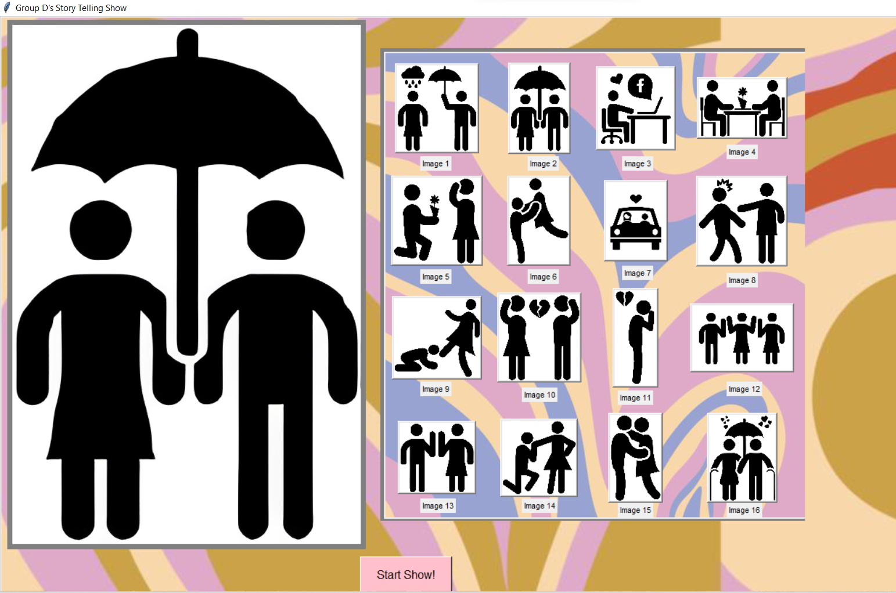

# Pixel Tint 32 x 32 System
This project is an interactive system that teaches us about the physical phenomenon on polarization of lights. Polarisers are controlled by servo motors to display pixelated images by rotating the polarizers to different angles to create different shades of grey.
## Our Feature

# ★Story Telling Show★
Our feature is about a captivating story of a couple's journey together and taking the viewers with them through their ups and downs during the relationship.

<br>

In this generation, many audiences are more drawn to drama and films these days which majority includes romantic genre's. Hence, we want our audiences, teenagers and adults from 13-21 year old to witness our show, and for them to either relate to or just appreciate at the end of it.
<br>

We want to showcase the emotions and feelings of the story through the lights and audio, and having the visuals from our very own pixelated images displayed out to the Pixel Tint Panel.
## What our feature consists of:
**Main GUI** 

*Screenshot of our GUI*
- Our GUI shows all of the images that will be displayed on the show starting from image 1 to image 16.
- Each image is a **button**. When the button is pressed individually **(right frame)**, the image will appear on the blank canvas **(left frame)**, and it will send out the image onto the polarizer panel.

*Close up of Image Buttons*

*Example of Image 2 being pressed*

*Image on the Polarizer Panel*


- At the bottom, we have the "Start Show" button which is a command that will automatically send all 16 images in a sequence of 15 seconds delay for each image to the polarizer panel.

<br>
*Screenshot of Start Show Button*
<br>

**Polarizer Panel**

*Picture of the Polarizer Panel*

- This is the polarizer panel which will be used to display our pixelized image.
- Each one of the circles is a polarizing film which is being controlled by a servo motor which receives instructions from the micro-controller.


<br>

## **Components**
---
| No. | Equipment |
| ----------- | ----------- |
| 1. |  Laptop |
| 2. |  Raspbery Pi 4 **OS: Raspbian Buster Full**|
| 3. |  **Avolites** Lighting Console |
| 4. |  Mixer - **Model: Yamaha QL1**|
| 5. |  Audio Amplifier - **Model: NXAMP4X2MK2**|
| 6. |  Speakers Line Array and Subwoofers **Model: P620 & L18**|

<br>


## **Setup**

### Getting the Raspberry Pi 4 connected


## Getting IP address to connect Raspi
>Open command prompt to find the network's IPv4 Address
```
ipconfig
```

<br>
*Screenshot of IPv4 address*


## Advnaced Port Scanner
>Based on the IPv4 address found, scan the network for your pi's IPv4 address
<br>
*Port scan of the network*

## Initial Boot of the Raspberry Pi 4
---
1. **Secure Shell (SSH)** into Raspberry Pi using **Putty**
```
Hostname: pi@ip_address
Port: 22
Password: (enter your password here)
```
<br>
*Screenshot of PuTTY configuration*

>"Save" and then "Load"
2. After logging in, update and upgrade raspberry pi
```
sudo apt update
sudo apt upgrade
```
## Configuring the Pi
---
>Enabling SSH
```
sudo raspi-config
```
Select `Interface Options` <br>
Select `P2 SSH`

>Enabling VNC
```
sudo raspi-config
```
Select `Interface Options`<br>
Select ` P3 VNC`

## VNC Viewer

>VNC is used to access the pi remotely.<br>
File>New Connection <br>
Add your raspberry pi's IPv4 and name
<br>
*VNC Viewer*
<br>
Now after connecting, we have successfully established remote control to the raspberry pi. 


<br>

---

## **Hardware Set Up**

<br>

**Audio Setup:**
<br>

1. Connect Raspberry Pi 4 to a power source
2. Using the XLR-M to a 3.5mm-M stereo cable, connect the 3.5mm jack into the Raspberry Pi 4 and the XLR-M to input 1 & 2 of the audio mixer.
3. Using a CAT6 ethernet cable, connect the amplifier to the mixer.
4. Using NL4 cables, connect the speakers and subwoofers to the audio amplifier.


*Picture of Audio Setup*

**Lighting Setup:**
<br>

The lights are being controlled manually in a console. Hence, it is a separate setup on its own.
<br>

1. In S536, the lights are connected and pre-patched in the console
2. For each image of our story, we created either cues or chases. We used lights such as the SL ePAR180,
3. 


## Communication of hardware 
Note that the lighting console is standalone for now.


---

## **Software Set Up** ##

<br>

## Communication of devices


# **Installing libraries**

To install the required libraries on our Raspberry Pi 4, we would need to open the terminal.
<br>
Firstly, update and upgrade your Raspberry Pi 4 using ```sudo apt update``` and ```sudo apt upgrade```.

<br>

### **MQTT**
To allow the Raspberry Pi 4 to publish a message to the broker pi, we would need to install the following;


#### Installing the MQTT client
```sudo apt install -y mosquitto-clients```
<br>
#### Install python MQTT script 
``` sudo pip3 install paho-mqtt```

### **Pillow**
To allow our Raspberry Pi to do basic image processing, we would need to install the PIL (pillow) library. To install the library,
<br>
```pip install pillow``` or ```python3 -m pip install pillow```

### **Pydub**
Installing the pydub library allows us to play, merge and edit our .wav audio files. To install the library,
<br>
```pip install pydub```


---
## Flow of code ##


